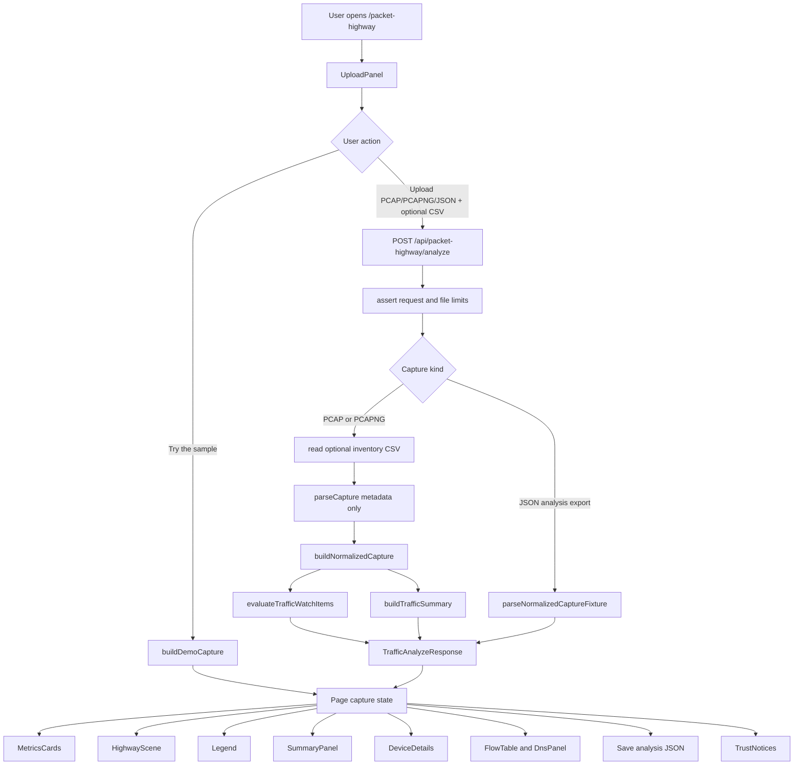

# Codex Multi-Agent Packet Highway Planning Report

Experiment: `codex-multi-agent-packet-highway-001`

Project: `itprodirect/psec-baseline-hunter`

Date: 2026-06-17

## 1. Executive Summary

This was a docs-only multi-agent planning session for Packet Highway / Traffic Visualizer. The current feature is already a coherent V0: a `/packet-highway` dashboard page accepts PCAP/PCAPNG or exported analysis JSON, optionally accepts inventory CSV, parses metadata in memory, normalizes flows/devices, applies deterministic watch rules, and renders a city/highway metaphor with masked sensitive details by default.

The multi-agent pass added value mainly by preserving tensions a single-pass summary might flatten:

- Product wants a 60-second "wow" demo centered on the unknown device and unencrypted HTTP.
- Visual design wants a more professional, less toy-like operations-map treatment.
- Security wants the feature to stay honest about metadata limits, malformed captures, forged JSON fixtures, and public upload abuse.
- QA wants browser smoke coverage and more upload/parser boundary tests before larger visual or parser expansion work.
- Skill extraction sees a reusable multi-agent planning skill, but cannot prove superiority without a single-agent baseline artifact.

Exactly one smallest high-value next implementation target is recommended:

**Make malformed-but-partially-parsed PCAP/PCAPNG inputs visibly partial.**

Today, parser caps set `truncated`, but some corrupt/truncated tails can break out after at least one packet without a partial marker. The next slice should mark those analyses as partial (or add parse warnings surfaced as partial analysis) and add focused tests. This is small, safety-aligned, demo-compatible, and supported by both Security / Parser and QA / Test findings.

No production code, tests, package files, config files, captures, data files, branches, commits, PRs, issues, or dependencies were changed in this session.

## 2. Preflight

| Item | Value |
| --- | --- |
| `cwd` | `C:\Users\user\Desktop\psec-baseline-hunter` |
| Repo root | `C:/Users/user/Desktop/psec-baseline-hunter` |
| Branch | `main` |
| Latest commit SHA | `109938f011b013a75de0ffb42ba352c4dc05b1c7` |
| Initial `git status --short` | Clean, empty output |
| Target report existed before session | `False` |
| Docs-only confirmation | Confirmed: this session wrote documentation only |
| Only-allowed-file confirmation | Intended and final allowed tracked file: `docs/reports/codex-multi-agent-packet-highway-001.md` |

Commands and tools used:

- Preflight: `Get-Location`, `git rev-parse --show-toplevel`, `git branch --show-current`, `git rev-parse HEAD`, `git status --short`, `Test-Path -LiteralPath docs\reports\codex-multi-agent-packet-highway-001.md`.
- Repo reading/search: `rg --files`, `Get-ChildItem -Name`, `Get-Content -Raw`, and `rg -n` over relevant Packet Highway docs, page, API route, components, services, types, demo, tests, and safety helpers.
- Multi-agent tools: spawned six read-only/no-edit explorer subagents and waited for all results.
- Filesystem setup: created missing directory `docs\reports`.
- No tests, lint, typecheck, build, dependency install, PR, issue, branch, tag, or commit were run or created.

## 3. Current Packet Highway Architecture

Packet Highway is documented as Traffic Visualizer V0 at `/packet-highway` in `docs/TRAFFIC_VISUALIZER.md`, while this experiment frames the planning target as V1. The current code and docs should be treated as V0 implementation evidence for a V1 planning slice.

Primary UI route:

- `src/app/(dashboard)/packet-highway/page.tsx`
  - Client page that owns capture state, server error, selected device, technical-detail reveal toggle, demo loading, and JSON export.
  - Calls `POST /api/packet-highway/analyze` for uploaded captures.
  - Loads synthetic demo data through `buildDemoCapture()`.
  - Renders upload panel, metrics, highway scene, selected device details, legend, summary/watch items, flow table, DNS panel, export notice, and partial-analysis notice.

Primary API route:

- `src/app/api/packet-highway/analyze/route.ts`
  - Accepts multipart form data with required `capture` and optional `inventory`.
  - Checks request content length, file kind, capture size, inventory type, and inventory size.
  - Parses `.json` as a sanitized normalized analysis fixture.
  - Parses `.pcap` / `.pcapng` into metadata aggregates and normalizes them.
  - Uses client-safe errors for upload/parser/CSV limit errors and generic fallback for unexpected errors.

Core services and contracts:

- `src/lib/types/packet-highway.ts`: `NormalizedCapture` contract, including devices, external endpoints, flows, animation events, DNS query metadata, summary, and alerts.
- `src/lib/services/pcap-parser.ts`: dependency-free PCAP/PCAPNG parser with caps for packets, flows, hosts, external IPs, and DNS names. Extracts metadata only, plus DNS/mDNS/LLMNR query names.
- `src/lib/services/traffic-normalizer.ts`: converts parser aggregates plus optional inventory to the UI model, picks heuristic gateway, applies output caps, builds animation events, alerts, and summary.
- `src/lib/services/capture-upload-safety.ts`: file kind/size checks, safe display filename, and sanitized fixture rebuilding.
- `src/lib/services/inventory.ts` and `src/lib/services/inventory-csv-safety.ts`: fault-tolerant CSV parsing and CSV size/row limits.
- `src/lib/services/traffic-risk-rules.ts`: deterministic watch rules with calm wording.
- `src/lib/services/traffic-summary.ts`: rule-based plain-English summary.
- `src/lib/constants/traffic-services.ts`: protocol/port service classification, service colors, labels, and metaphor text.
- `src/lib/demo/packet-highway-demo.ts`: synthetic demo using locally administered MACs, TEST-NET IPs, example domains, and the real normalizer/rules pipeline.

Main components:

- `UploadPanel.tsx`: drag/drop upload UI, local file validation, optional CSV selection, sample button, privacy copy.
- `HighwayScene.tsx`: SVG map with internet, gateway, buildings, roads, flow traces, animated vehicles, pause/reduced-motion behavior.
- `scene-layout.ts`: pure scene layout and path math.
- `scene-nodes.tsx`: cloud, gateway, broadcast, and building SVG nodes, including unknown-device marker.
- `useVehicleAnimation.ts`: requestAnimationFrame loop for moving traffic dots.
- `MetricsCards.tsx`: packet/device/conversation/endpoint/DNS/watch metrics.
- `Legend.tsx`: service category legend.
- `SummaryPanel.tsx`: plain-English summary and watch-item list.
- `DeviceDetails.tsx`: selected-device facts with masked/revealed identifiers.
- `FlowTable.tsx`: busiest conversations and DNS name grouping.
- `TrustNotices.tsx`: saved JSON and partial-analysis notices.

Safety boundaries already present:

- Captures and normalized JSON are size-limited.
- Parser caps large inputs and marks capped analyses as truncated.
- Capture parsing is intended to be in-memory only for Packet Highway.
- Packet payload contents are not extracted into normalized output.
- DNS/mDNS/LLMNR query names are treated as metadata but still sensitive.
- Technical identifiers are masked by default and can be revealed by user action.
- Exported JSON is warned as sensitive metadata.
- `.gitignore` blocks raw captures, Zeek logs, raw flow JSON, local inventories, and local sample directories.

Fragile/confusing areas:

- Gateway detection is heuristic: the MAC fronting the most external IPs.
- Ethernet captures only; Wi-Fi monitor mode, Linux SLL, and raw IP are unsupported.
- DNS answers are not parsed, so external endpoints are IP-focused.
- JSON fixture upload sanitizes shape, but does not prove provenance.
- Service categories come from protocol/ports, not packet content.
- UI/server CSV size constants can drift.
- Some malformed capture tails can currently end parsing after packets were read without a visible partial marker.

## 4. Mermaid Architecture Diagram



## 5. Subagent Findings

### 5.1 Repo Cartographer

Mini-goal: map routes, pages, components, services, data flow, safety boundaries, Mermaid draft, and fragile/confusing areas.

Findings:

- Packet Highway is a contained Next.js feature rooted at `/packet-highway`.
- The page owns client state and calls the analyze route; the analyze route validates inputs, parses captures or fixtures, normalizes, and returns `TrafficAnalyzeResponse`.
- The UI is split cleanly between upload, metrics, scene, legend, summary/watch items, device details, and flow/DNS tables.
- Core safety boundaries are visible in docs and code: upload limits, metadata-only parser contract, safe errors, default masking, export warning, and `.gitignore` protections.
- Fragile areas include heuristic gateway detection, Ethernet-only captures, no DNS answer parsing, fixture upload bypassing new CSV inventory parsing, duplicated CSV size limits, and port-based classification.

Uncertainty:

- Did not run tests. Coverage was inferred from source and `tests/packet-highway-tests.js`.

### 5.2 Product / Demo

Mini-goal: design the best 60-second non-technical demo.

Findings:

- Best user story: a non-technical home or small-office user wants to tell "normal busy" from "worth checking" without packet-analysis jargon or raw identifiers.
- Best demo arc:
  1. Open Traffic Visualizer.
  2. Click `Try the sample`.
  3. Point to metrics.
  4. Show the animated city and legend.
  5. Click the orange unknown-device building.
  6. Show calm watch items: unknown device and unencrypted HTTP.
  7. Point to `Show technical details` as a privacy-controlled investigation step.
- Wow moment: the mystery device absent from inventory becomes a visible question-mark building, then resolves into non-alarmist explanation and next-review context.
- Hide/de-emphasize during demo: raw PCAP mechanics, parser internals, capture limits, Wireshark instructions, JSON export, full flow table, raw IP/MAC/port details, and broader scorecard/diff workflows.
- Top improvements: demo story mode, mark-known/guest/investigate actions, align device/known counts, more human-readable internet endpoints, and rendered demo smoke test.

Uncertainty:

- Docs/code label the feature V0 or unreleased, while the prompt asks for V1. This report treats current code as V0 evidence for V1 planning.

### 5.3 Visual / Storytelling

Mini-goal: improve the cars/buildings/highway metaphor professionally.

Findings:

- The metaphor should stay because it is already coherent, but it should become less toy-like.
- Three viable visual directions:
  1. Professional Network District: clean civic/operations map, buildings as endpoints, gateway as checkpoint, internet as service district.
  2. Traffic Control Room: schematic dashboard, route shields/service badges, inspection markers, muted grid.
  3. Home / Office Street Map: accessible neighborhood map, known devices as named properties, unknown as dashed outline, broadcast as bulletin board.
- Normal traffic should use steady muted routes, thickness for volume, and service color chips.
- Review/suspicious traffic should use amber outlines, route shoulders, or inspection badges. Avoid blanket red alarm styling.
- Avoid making literal emoji vehicles the primary visual language. Use abstract service glyphs and disciplined geometry.

Uncertainty:

- Best direction depends on audience: families/home users favor street map, small business favors network district, security/compliance favors control room.
- No rendered screenshot QA was performed.

### 5.4 Security / Parser

Mini-goal: review parser, uploads, fixtures, CSV, file handling, privacy, abuse risks, malformed inputs, errors, and claims.

Findings:

- Strong baseline: bounded capture size, parser/object caps, metadata-only extraction, safe error allow-listing, fixture rebuilding, and export warning.
- Main risks:
  - `request.formData()` can buffer before app checks if `Content-Length` is absent or platform limits are not enforced.
  - Corrupt/truncated PCAP/PCAPNG tails can break parsing after packets were read without marking output partial.
  - Repeated 50 MiB uploads can burn CPU/memory even with parser caps.
  - JSON fixtures are safe-shaped but forgeable.
  - Adjacent Nmap XML parsing is full-memory and under-capped.
  - CSV export has spreadsheet formula injection risk in broader app export paths.
  - Legacy Streamlit may display absolute paths/errors.
- Safe claims: metadata-only parsing, no packet payload bytes in normalized output, DNS/mDNS/LLMNR query names extracted, Packet Highway does not intentionally write capture files to disk, capped parses may be partial.
- Claims to avoid: no sensitive data, complete network view, malware/attack detected, client-only/private for remote deployments, or no findings when input was invalid.

Uncertainty:

- No repo evidence was found for proxy/CDN/runtime body limits, rate limits, or deployment-level upload protections.

### 5.5 QA / Test

Mini-goal: summarize Packet Highway coverage and identify missing tests and next test improvements.

Findings:

- Existing Packet Highway tests are synthetic and in-memory, matching privacy constraints.
- Static review found coverage for service classification, PCAP/PCAPNG parsing, DNS extraction, parser caps, gateway detection, inventory merge, watch rules, fixture validation, demo round-trip, and analyze API happy/error paths.
- UI-ish checks are limited to server-rendered trust notices and source assertions; there is no browser automation.
- Missing tests:
  - Browser smoke for demo, reveal/hide details, save/upload JSON, scene selection, animation pause, and responsive layout.
  - Parser branches for big-endian/nanosecond PCAP, PCAPNG simple packet blocks, timestamp resolution, mixed interfaces, VLAN, IPv6/ICMP, and host cap.
  - Route-level negative tests for zero-byte uploads, invalid `Content-Length`, route oversize, filename sanitization, and oversized/too-many-row CSV.
  - Normalizer/UI output cap tests.
- Smallest next tests proposed: upload/API boundary tests, normalizer cap test, stable exported Packet Highway JSON fixture, parser branch tests, and a manual browser smoke checklist.

Uncertainty:

- No tests were run in this planning session, so coverage is static/source-based, not measured.

### 5.6 Skill Extractor

Mini-goal: decide whether this workflow should become an agent-skills-library skill.

Findings:

- Recommendation: yes, but generalize beyond Packet Highway as `multi-agent-evidence-planning`.
- Reusable parts:
  - Evidence packet template.
  - Subagent roles: cartographer, product/demo, visual/storytelling, security/privacy, QA/test, skill extraction.
  - No-edit planning contract.
  - Synthesis rubric that preserves evidence, inference, disagreements, and quality gates.
- Proposed shape:

```text
multi-agent-evidence-planning/
  SKILL.md
  agents/openai.yaml
  references/
    evidence-packet-template.md
    subagent-role-prompts.md
    value-measurement-rubric.md
```

- Measurement: compare a normal single-agent prompt against multi-agent planning using blind scoring for evidence coverage, issue discovery, unsupported claims, gate specificity, downstream rework, reviewer comments avoided, and time/token cost.

Uncertainty:

- Confidence is medium because there is no saved single-agent baseline transcript for this experiment.

## 6. Agreement Table

| Theme | Agents | Agreement | Implication |
| --- | --- | --- | --- |
| Feature is bounded and coherent | Cartographer, Product, QA, Security | Packet Highway is a contained route/API/components/services feature with a clear normalized model. | V1 planning can target small slices without broad repo churn. |
| Privacy/trust contract is central | Cartographer, Product, Security, Visual, Skill | Metadata-only, masked identifiers, safe wording, and export warning are not optional polish. | Next work should preserve trust claims and avoid overstatement. |
| Demo value is real | Product, Visual, QA | The synthetic demo already supports unknown-device plus HTTP watch-item narrative. | A 60-second demo can work from current assets, but should be tested/rendered before relying on it externally. |
| Watch wording must stay calm | Product, Visual, Security | The app should present observations, not verdicts. | Avoid "malware", "attack", "safe", or "complete" claims unless future deterministic evidence supports them. |
| Tests are meaningful but incomplete | QA, Security, Cartographer | Synthetic tests cover many parser/rule/API paths, but browser and boundary gaps remain. | Add targeted boundary tests before bigger UX claims or parser support expansion. |
| Visual metaphor needs maturity | Product, Visual, Security | City/highway helps non-technical users, but literal cars/emojis can undermine professional trust. | Future visual work should use disciplined map/control-room language. |
| Multi-agent planning found useful tensions | Main, Skill, all role outputs | Subagents surfaced different priorities and did not fully converge. | The process added planning value, though not proven quantitatively without a baseline. |

## 7. Disagreement / Tension Table

| Tension | Sides | Main-agent synthesis |
| --- | --- | --- |
| V0 vs V1 naming | Repo/docs say V0/unreleased; user asked for V1 planning. | Treat current implementation as V0 evidence and plan V1 slices explicitly. Do not rename casually. |
| Demo polish vs safety first | Product/Visual want story mode and professional visual polish; Security/QA found trust and boundary gaps. | Pick a trust slice first: malformed partial capture honesty. Demo polish follows once the data contract is sharper. |
| Approachable metaphor vs professional credibility | Product likes non-technical city story; Visual warns against toy-like literal vehicles. | Keep metaphor, reduce literalness. Use route badges/glyphs and calm inspection styling. |
| JSON fixture convenience vs evidence integrity | Product/QA value JSON round-trip; Security notes fixtures can be forged. | Keep JSON import but label it as loaded analysis, not raw capture evidence, in future UX. |
| "In memory/private" vs public deployment reality | Code says Packet Highway parses in memory; Security notes multipart buffering and platform limits can still matter. | Safe claim is "not intentionally stored by this app"; avoid stronger privacy claims without deployment controls. |
| Browser automation now vs manual smoke first | QA wants browser coverage; implementation cost may be higher than parser tests. | Add manual smoke checklist and one later browser smoke, but first fix/test the parser honesty gap. |
| Expand parser support vs protect V0 scope | Roadmap/demos may want broader capture formats; Security/QA prefer smaller bounded parser work. | Do not add Wi-Fi/SLL/raw-IP until malformed/partial handling and tests are stronger. |

## 8. Risk Table

| Risk | Severity | Likelihood | Evidence / Reason | Mitigation |
| --- | --- | --- | --- | --- |
| Malformed PCAP/PCAPNG tail can look complete after partial parse | High | Medium | Security identified silent `break` paths after packets are read; QA called for valid-first-packet plus corrupt-tail tests. | Mark output `truncated` or add `parseWarnings`; surface existing partial-analysis notice; add focused tests. |
| Multipart buffering/resource abuse | High | Medium | App checks content length before `formData()`, but missing headers/platform buffering can bypass app-level intent. | Deployment body limits, reject missing content length for uploads if acceptable, rate/concurrency limits, future streaming parser. |
| JSON fixture provenance confusion | Medium | Medium | Fixture path sanitizes shape but cannot prove metrics/alerts came from raw capture. | Label imported JSON as loaded analysis; consider signing/hashes later. |
| Visual overclaiming | High | Medium | City/vehicles can imply causality or diagnosis beyond metadata. | Use "observed", "suggests", "worth reviewing"; avoid attack/malware/safe/complete language. |
| No browser smoke coverage | Medium | High | UI is only source/server-render checked; no rendered demo smoke. | Add manual smoke checklist, then Playwright-style smoke when implementation begins. |
| Gateway heuristic misidentification | Medium | Medium | Gateway is selected by external-IP fronting votes. | Label as inferred gateway; allow correction later; avoid strong topology claims. |
| Adjacent Nmap XML full-memory parsing | Medium | Medium | Security found under-capped XML path outside Packet Highway. | Separate issue for XML caps and invalid `<nmaprun>` handling. |
| CSV spreadsheet formula injection in exports | Medium | Medium | Broader CSV export escapes quotes/commas but not formula-leading cells. | Prefix spreadsheet-dangerous exported strings. |
| UI/server CSV size drift | Low | Medium | CSV max size is duplicated in upload UI and server safety module. | Export/import shared constant or add test. |
| Raw capture/data leakage by commit | High | Low | `.gitignore` blocks raw captures and local traffic outputs. | Keep final changed-files checks; never stage captures/inventories. |

## 9. Recommended Next Implementation Target

Exactly one smallest high-value next target:

**Malformed capture partial honesty.**

Goal:

When the parser successfully reads one or more packets but then encounters a malformed/truncated classic PCAP or PCAPNG tail/block, the resulting analysis should be visibly partial rather than silently looking complete.

Why this target:

- It protects the app's trust model.
- It is smaller than visual redesign, browser automation, expanded parser support, or upload infrastructure.
- It is supported independently by Security / Parser and QA / Test.
- It improves demo credibility because the UI already has `PartialAnalysisNotice`.
- It can be tested without real captures or new dependencies.

Suggested implementation boundaries:

- Likely files: `src/lib/services/pcap-parser.ts`, `src/lib/services/traffic-normalizer.ts` only if the parser needs a warning field propagated, `src/lib/types/packet-highway.ts` only if adding warnings to the public model, and `tests/packet-highway-tests.js`.
- Preferred minimal model: if corrupt tail/block is encountered after at least one packet, set existing `extract.truncated = true`.
- If more specific user-facing detail is needed, add `parseWarnings` later; do not overbuild this first slice.

Acceptance criteria:

- A classic PCAP with one valid packet followed by a truncated/corrupt record produces `meta.truncated === true` after normalization.
- A PCAPNG with one valid packet followed by a corrupt block/length produces `meta.truncated === true`.
- A zero-packet malformed file still returns a friendly parse error rather than a misleading empty success.
- Existing parser caps still set `truncated`.
- No payload bytes are extracted or displayed.
- Tests are synthetic/in-memory only.
- `npm test` is run and reported in the implementation session.

## 10. Proposed GitHub Issues

No GitHub issues were created. Proposed issue drafts:

1. **Mark malformed partial PCAP/PCAPNG parses as partial**
   - Scope: parser honesty and tests for valid-prefix corrupt-tail captures.
   - Acceptance: `meta.truncated` true for partial parses; friendly errors for zero usable packets; synthetic tests pass.

2. **Add Packet Highway manual/browser smoke coverage**
   - Scope: `/packet-highway` demo load, sample click, unknown marker, watch items, reveal toggle, JSON save/re-upload, bad file errors, mobile layout.
   - Acceptance: checklist documented first; automated smoke added when test infrastructure is ready.

3. **Professionalize Packet Highway visual language**
   - Scope: evolve city/highway metaphor toward operations-map/control-room style with route badges and calm inspection markers.
   - Acceptance: no alarmist red-by-default, no toy-like primary emojis, normal vs review states visually distinct.

4. **Label imported analysis JSON provenance**
   - Scope: distinguish exported/saved analysis JSON from raw capture evidence.
   - Acceptance: UI copy and metadata make forged/loaded fixture status clear.

5. **Audit upload and export abuse boundaries**
   - Scope: missing content length policy, route-level oversize tests, rate/concurrency guidance, CSV formula injection in broader exports.
   - Acceptance: documented deployment assumptions and focused tests/fixes.

## 11. Suggested Next Codex /goal For Implementation

```text
/goal

Project: itprodirect/psec-baseline-hunter

Goal:
Implement the smallest Packet Highway trust fix: malformed-but-partially-parsed PCAP/PCAPNG inputs must be surfaced as partial/truncated instead of looking complete.

Constraints:
- No dependency installs unless absolutely required.
- Do not touch visual redesign, demo story mode, PR/issue/branch/commit creation, or unrelated parser expansion.
- Keep real captures and inventories out of the repo.
- Use synthetic/in-memory test captures only.

Likely files:
- src/lib/services/pcap-parser.ts
- tests/packet-highway-tests.js
- Only touch src/lib/types/packet-highway.ts or traffic-normalizer.ts if a warning field is truly needed.

Acceptance:
- Classic PCAP with one valid packet plus corrupt/truncated tail normalizes with meta.truncated === true.
- PCAPNG with one valid packet plus corrupt/truncated block normalizes with meta.truncated === true.
- Zero-packet malformed inputs still produce friendly errors.
- Existing cap behavior still works.
- No payload bytes are extracted.
- Run npm test and report results.
- Final git status shows only intentional files changed.
```

## 12. Skill Extraction Recommendation

Recommendation: create a reusable planning skill named `multi-agent-evidence-planning`, not a Packet Highway-specific skill.

Why:

- The workflow generalizes well: evidence packet, specialized reviewers, no-edit planning contract, synthesis preserving disagreement, and explicit next-slice selection.
- The Packet Highway run showed useful disagreement discovery across product, visual, security, QA, architecture, and skill-extraction lenses.
- The value is strongest for sensitive/product-facing features where trust claims, UX story, and tests must align.

Proposed skill inputs:

- Repo path and feature name.
- User constraints and allowed write scope.
- Planning question and target audience.
- Required evidence files or discovery hints.
- Risk domains to include.
- Optional single-agent baseline output for comparison.

Proposed skill outputs:

- Preflight snapshot.
- Evidence packet.
- Role findings.
- Agreement and disagreement tables.
- Risk table.
- Exactly one recommended next target.
- Quality gates and suggested next `/goal`.
- Value measurement note.

Quality gates:

- Every major claim cites repo evidence or is labeled inference.
- At least one role challenges privacy/security/trust claims.
- Disagreements are preserved, not flattened.
- Final target is smaller than the set of all good ideas.
- Planning mode leaves only the allowed report artifact changed.

Measurement:

- Run one normal single-agent planning prompt and one multi-agent planning prompt on the same feature.
- Blind-score both for evidence coverage, risk discovery, unsupported claims, gate specificity, downstream implementation rework, reviewer comments avoided, and time/token cost.
- Multi-agent planning should only be considered better if it finds materially more risks or produces clearer implementation gates for acceptable overhead.

## 13. Final Changed Files Check

Final checks after writing this report:

- `git status --short --untracked-files=all` showed only `?? docs/reports/codex-multi-agent-packet-highway-001.md`.
- `git diff --check` exited cleanly.
- No other tracked or untracked files were changed by this session.

Final changed file:

- `docs/reports/codex-multi-agent-packet-highway-001.md`
